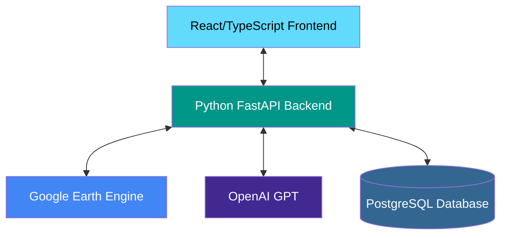

# 🌍 Disaster Eye: Real-time Disaster Monitoring System

[](https://github.com/your-username/disaster-eye-earth-engine/actions)
[](https://reactjs.org/)
[](https://fastapi.tiangolo.com/)
[](https://earthengine.google.com/)


Disaster Eye is an advanced geospatial analysis platform that leverages Google Earth Engine to provide real-time disaster monitoring, risk assessment, and vulnerability analysis. This comprehensive solution helps in identifying flood-prone areas, analyzing building footprints, and assessing disaster risks using satellite imagery and geospatial data.

https://github.com/user-attachments/assets/64ea4cb6-6cd5-43ac-892e-e1148193d493

## ✨ Key Features

### 🛰️ Real-time Satellite Analysis
- **Multi-source Satellite Data**: Integrates Sentinel-1 SAR, Sentinel-2 Optical, and Landsat data
- **Flood Detection**: Real-time water body mapping and change detection
- **Vegetation Analysis**: NDVI and other vegetation indices for impact assessment
- **Topographic Analysis**: SRTM elevation data for flood risk modeling

### 🤖 AI-Powered Insights
- **Natural Language Interface**: Ask questions in plain English about locations
- **GPT Integration**: Context-aware analysis and intelligent recommendations
- **Automated Reporting**: Generate PDF/PNG reports with analysis results
- **Predictive Analytics**: Historical trend analysis and risk prediction

### 📊 Comprehensive Risk Assessment
- **Flood Vulnerability Mapping**: Identify high-risk zones with real-time data
- **Building Impact Analysis**: Assess potential damage to infrastructure
- **Population Exposure**: Estimate affected populations in disaster scenarios
- **Critical Infrastructure**: Map and analyze essential services vulnerability

### 🎯 User Experience
- **Interactive Web Interface**: Built with React and TypeScript
- **Responsive Design**: Works seamlessly across devices
- **Real-time Visualization**: Dynamic layer control and data visualization
- **Intuitive Controls**: Easy-to-use interface for complex geospatial analysis

## 🏗️ System Architecture



### Components Overview

1. **Frontend (React/TypeScript)**
   - Interactive map interface using Leaflet/Mapbox
   - Real-time data visualization
   - Responsive UI for all device types

2. **Backend (Python FastAPI)**
   - RESTful API endpoints
   - Authentication and authorization
   - Data processing and analysis

3. **Google Earth Engine**
   - Satellite imagery processing
   - Geospatial analysis
   - Terrain and elevation data

4. **AI/ML Services**
   - Natural language processing
   - Predictive analytics
   - Automated report generation

5. **Database**
   - User data storage
   - Analysis results caching
   - Historical data archiving

## 🚀 Quick Start Guide

### Prerequisites
- Node.js v16+ and npm/yarn
- Python 3.8+
- Google Earth Engine account
- Google Cloud Project with Earth Engine API enabled

### Installation

1. **Clone the repository**
   ```bash
   git clone https://github.com/your-username/disaster-eye-earth-engine.git
   cd disaster-eye-earth-engine
   ```

2. **Set up the backend**
   ```bash
   cd backend
   python -m venv venv
   source venv/bin/activate  # On Windows: .\venv\Scripts\activate
   pip install -r requirements.txt
   ```

3. **Set up the frontend**
   ```bash
   cd ..
   npm install
   ```

4. **Configure environment variables**
   Create a `.env` file in the root directory with:
   ```env
   VITE_API_URL=http://localhost:8000
   VITE_GOOGLE_MAPS_API_KEY=your_google_maps_api_key
   ```

   For the backend, create a `.env` file in the `backend` directory:
   ```env
   GOOGLE_APPLICATION_CREDENTIALS=path/to/your/service-account-key.json
   EE_SERVICE_ACCOUNT=your-service-account@your-project.iam.gserviceaccount.com
   OPENAI_API_KEY=your_openai_api_key
   ```

### Running the Application

1. **Start the backend server**
   ```bash
   cd backend
   uvicorn main:app --reload
   ```

2. **Start the frontend development server**
   ```bash
   cd ..
   npm run dev
   ```

3. **Access the application**
   Open your browser and navigate to `http://localhost:5173`

### First-Time Setup for Earth Engine

1. **Authenticate with Google Earth Engine**
   ```bash
   cd backend
   python -c "import ee; ee.Authenticate()"
   ```
   Follow the instructions to authenticate with your Google account.

2. **Initialize Earth Engine**
   ```bash
   python -c "import ee; ee.Initialize()"
   ```

### Development Workflow

- **Frontend Development**: `npm run dev`
- **Backend Development**: `uvicorn main:app --reload`
- **Running Tests**: `npm test` (frontend) and `pytest` (backend)
- **Building for Production**: `npm run build` (frontend) and `gunicorn main:app` (backend)


#### Data Endpoints
- `GET /api/flood-analysis` - Get flood analysis for coordinates
- `GET /api/building-analysis` - Get building analysis for coordinates
- `GET /api/terrain-data` - Get terrain elevation data

#### AI Endpoints
- `POST /api/query` - Process natural language queries
  ```json
  {
    "query": "Show flood prone areas near Mumbai",
    "context": {}
  }
  ```

For detailed API documentation, visit `http://localhost:8000/docs` when the backend server is running.

## 🤝 Contributing

We welcome contributions from the community! Here's how you can help:

1. **Report Bugs**: Open an issue with detailed reproduction steps
2. **Suggest Features**: Propose new features or improvements
3. **Submit Pull Requests**: Follow these steps:
   - Fork the repository
   - Create a feature branch (`git checkout -b feature/AmazingFeature`)
   - Commit your changes (`git commit -m 'Add some AmazingFeature'`)
   - Push to the branch (`git push origin feature/AmazingFeature`)
   - Open a Pull Request

### Development Guidelines
- Follow the existing code style
- Write unit tests for new features
- Update documentation as needed
- Keep commits focused and descriptive

## 📄 License

This project is licensed under the MIT License - see the [LICENSE](LICENSE) file for details.

## 🙏 Acknowledgments

- [Google Earth Engine](https://earthengine.google.com/) for satellite imagery and geospatial processing
- [FastAPI](https://fastapi.tiangolo.com/) for the high-performance backend
- [React](https://reactjs.org/) and [TypeScript](https://www.typescriptlang.org/) for the frontend
- [OpenAI](https://openai.com/) for AI/ML capabilities
- All contributors who have helped improve this project

## 📧 Contact

For questions or feedback, please open an issue or contact the project maintainers.

## 🛠️ Quick Setup

### Prerequisites
- Node.js 18+
- Python 3.8+
- Google Earth Engine Account
- GROQ API Key (optional)

### 1. Clone & Install
```bash
git clone <https://github.com/PR-HARIHARAN/GeoChat-Agent.git>
cd disaster-eye-earth-engine
npm install
```

### 2. Backend Setup
```bash
cd backend
pip install -r requirements.txt

# Copy and configure environment
cp .env.example .env
# Edit .env with your Google Earth Engine and OpenAI credentials
```

### 3. Frontend Setup
```bash
# Copy and configure environment  
cp .env.example .env
# Edit .env with your backend URL (default: http://localhost:8000)
```

### 4. Google Earth Engine Authentication

**Option A: Service Account (Recommended)**
1. Create a Google Cloud Project
2. Enable Earth Engine API
3. Create service account and download JSON key
4. Place `service-account-key.json` in `backend/` directory

**Option B: Personal Account**
```bash
earthengine authenticate
```

### 5. Start Development Servers
```bash
# Start both frontend and backend
npm run dev:both

# Or start separately:
npm run dev:backend  # Backend on port 8000
npm run dev          # Frontend on port 8080
```

## 🔧 Configuration

### Backend Environment (`backend/.env`)
```env
# Google Earth Engine
EE_SERVICE_ACCOUNT=your-service-account@project.iam.gserviceaccount.com
EE_PRIVATE_KEY_PATH=service-account-key.json

# OpenAI (optional)
OPENAI_API_KEY=sk-your-openai-key

# API Settings
API_HOST=0.0.0.0
API_PORT=8000
FRONTEND_URL=http://localhost:8080
```

### Frontend Environment (`.env`)
```env
VITE_API_URL=http://localhost:8000
```

## 📖 Usage

### 1. Natural Language Queries
Type questions like:
- "What is the flood vulnerability in Tamil Nadu?"
- "Analyze building damage in the selected area"
- "Show me social vulnerability for this region"

### 2. Interactive Map Analysis
- Click anywhere on the map to analyze that location
- Toggle between different satellite layers
- Use drawing tools for area analysis

### 3. Real-time Monitoring
- Monitor API connection status (green = connected)
- View live satellite data processing
- Get instant analysis results

## 🔌 API Endpoints

| Endpoint | Method | Description |
|----------|--------|-------------|
| `/health` | GET | API health check |
| `/api/earth-engine/query` | POST | Process natural language queries |
| `/api/earth-engine/analyze-location` | POST | Analyze specific coordinates |
| `/api/earth-engine/map-layers` | GET | Get satellite map layers |
| `/api/earth-engine/flood-analysis` | GET | Flood vulnerability analysis |
| `/api/earth-engine/building-analysis` | GET | Building damage assessment |

## 📊 Data Sources

- **Copernicus Sentinel-1**: SAR data for flood detection
- **Copernicus Sentinel-2**: Optical imagery for land cover analysis
- **SRTM Global**: Digital elevation model for topographic analysis
- **Google Earth Engine**: Cloud-based planetary-scale geospatial analysis

## 🎨 Tech Stack

### Frontend
- React 18 with TypeScript
- Vite for fast development
- ShadCN UI components
- Tailwind CSS for styling
- React Query for state management

### Backend  
- FastAPI for high-performance APIs
- Google Earth Engine Python API
- OpenAI GPT for natural language processing
- Pydantic for data validation
- CORS middleware for cross-origin requests

## 🔄 Development Workflow

### Adding New Analysis Types
1. Implement in `backend/services/earth_engine_service.py`
2. Add API endpoint in `backend/main.py`
3. Update frontend API client in `src/services/earthEngineAPI.ts`
4. Add UI components for data visualization

### Customizing AI Responses
1. Modify intent extraction in `backend/services/ai_service.py`
2. Add new query patterns and response templates
3. Update confidence scoring and suggested actions

## 🌍 Use Cases

### Disaster Response
- **Emergency Planning**: Identify vulnerable areas before disasters
- **Real-time Assessment**: Monitor disaster impact as it happens  
- **Resource Allocation**: Optimize emergency response deployment
- **Recovery Planning**: Assess damage for reconstruction priorities

### Research & Analysis
- **Climate Studies**: Long-term vulnerability trend analysis
- **Urban Planning**: Infrastructure resilience assessment
- **Risk Modeling**: Predictive disaster impact modeling
- **Policy Making**: Evidence-based disaster management policies

## 🚀 Deployment

### Backend (Production)
```bash
# Install dependencies
pip install -r requirements.txt

# Set production environment variables
export EE_SERVICE_ACCOUNT="your-production-service-account"
export OPENAI_API_KEY="your-production-openai-key"

# Run with production server
uvicorn main:app --host 0.0.0.0 --port 8000
```

### Frontend (Production)
```bash
# Build for production
npm run build

# Deploy dist/ folder to your hosting service
```

## 🤝 Contributing

1. Fork the repository
2. Create a feature branch: `git checkout -b feature/amazing-feature`
3. Commit changes: `git commit -m 'Add amazing feature'`
4. Push to branch: `git push origin feature/amazing-feature`
5. Open a Pull Request

## 📄 License

This project is for educational and research purposes. Please ensure compliance with:
- Google Earth Engine Terms of Service
- OpenAI API Terms of Use  
- Satellite data usage policies

## 🆘 Support

For detailed setup instructions, see [SETUP.md](./SETUP.md)

For issues and questions:
1. Check the troubleshooting section in SETUP.md
2. Search existing GitHub issues
3. Create a new issue with detailed description

## 🙏 Acknowledgments

- Google Earth Engine for planetary-scale geospatial analysis
- Copernicus Program for Sentinel satellite data
- React and FastAPI communities for excellent frameworks

---

**Built with ❤️ for disaster resilience and community safety**
